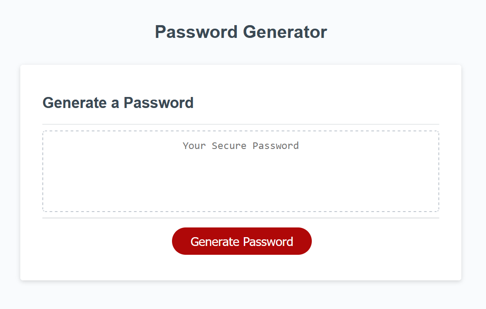

# PasswordGenerator

## Description

This was created for a coding bootcamp - Challenge #3

The goal was to write code that would ask the user for parameters and then generate a random password string using javascript.

## Installation

[Github Repo link.](https://github.com/flying-tadpole/PasswordGenerator)

[Github Pages link.](https://flying-tadpole.github.io/PasswordGenerator/)

Preview:

## Credits

Code snippets provided as a part of coding bootcamp.

Extensive use of [mdn web docs](https://developer.mozilla.org/en-US/) used for reference of methods. 
